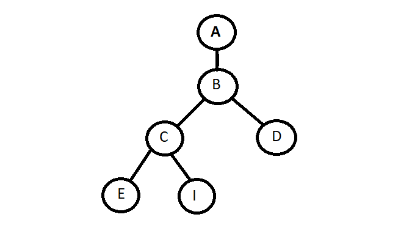

# Tree_path
find the path between two nodes in the tree 
# stage 1 : Lire l'arber depuis tree.txt et créer une liste chainée
pour tree.txt c'est l'arbre des élements codée avec ma propre technique 
* Exemple:
l'arbre suivant  
  
sera traduit comme ce ci :  
  >   A > B > D < B > C > E < C > I  

* '>': pour ajouter un element dans la prochaine generation de l'arbre   
* '<': pour retourner a l'element aprée le '<' et créer une branche  
au même temp en remplie la liste chainée  
pour la manipulation des branches j'ai creé un tableaux de pointeurs   "next[]" qui stocke les pointeurs des élements suivants branches  
# stage 2 : chercher le chemin entre deux villes "entre deux élements de larbre"
### premiérement on cherche si les deux villes existe dans l'arbre (map) 
Si On trouve les deux On recule depuis l'arrivée vers le départ

